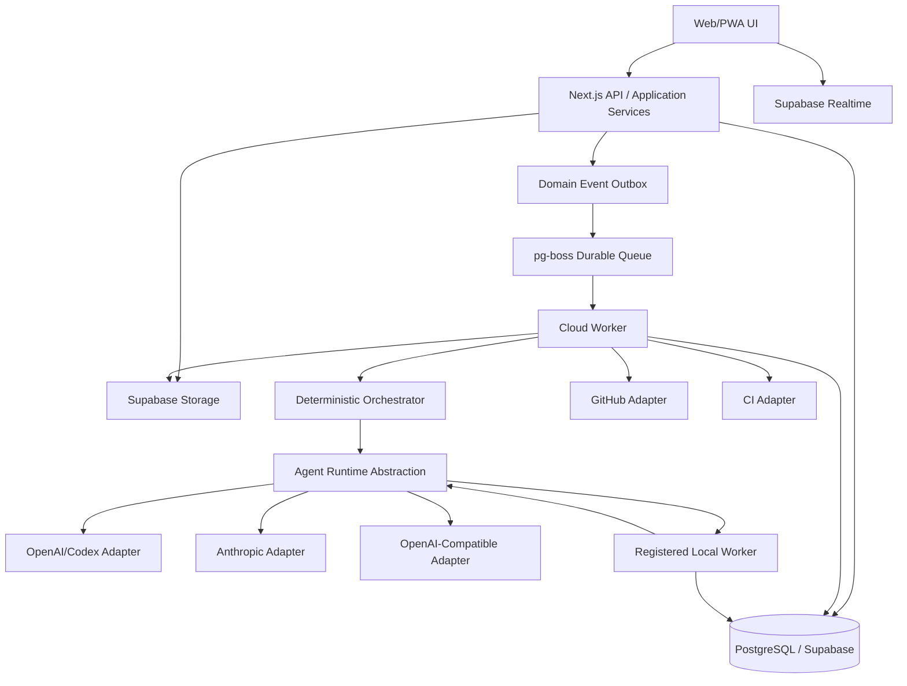

# Bunker Studio — Architecture

## 1. Logical architecture



## 2. Why web/API and worker are separate

Web:
- interactive requests;
- auth;
- CRUD;
- chat streaming handoff;
- approval actions;
- UI queries.

Worker:
- long-running agent turns;
- repository checkout;
- tests;
- delayed retry;
- meeting workflows;
- summary/embedding jobs;
- export generation.

No long provider/code job must depend on a serverless request remaining alive.

## 3. Core packages

### `packages/core`

Pure domain:
- entities;
- value objects;
- policies;
- state transitions;
- budget math;
- authorization helpers independent of Supabase.

No provider SDK imports.

### `packages/contracts`

Zod schemas for:
- API;
- agent inputs/outputs;
- provider normalized events;
- orchestration plans;
- review findings;
- design proposals;
- meeting minutes;
- export manifest.

### `packages/db`

- Supabase clients;
- typed queries;
- migrations helpers;
- transaction helpers;
- repositories;
- RLS test helpers.

### `packages/orchestration`

- task state machine;
- dependency resolver;
- scheduler;
- parallelism validation;
- approval gate evaluator;
- budget gate evaluator;
- retry policy;
- quota resume;
- event handlers.

No direct vendor call.

### `packages/agent-runtime`

Interfaces:
- `AgentRuntime`;
- `AgentSession`;
- `RunRequest`;
- `RunEvent`;
- `RunResult`;
- `RuntimeCapability`;
- `RuntimeError`.

### provider packages

Translate native SDK/harness behavior to normalized runtime types.

### `packages/git`

Initial GitHub:
- repository metadata;
- branch/worktree operations;
- PR;
- status checks;
- webhook verification.

### `packages/notifications`

- in-app;
- Web Push;
- notification preferences.

### `packages/observability`

- logger;
- correlation IDs;
- cost/usage metrics;
- OpenTelemetry-ready interface.

## 4. Agent runtime interface

Conceptual TypeScript contract:

```ts
interface AgentRuntime {
  getCapabilities(): Promise<RuntimeCapabilities>;

  start(input: StartRunInput): AsyncIterable<NormalizedRunEvent>;

  resume(input: ResumeRunInput): AsyncIterable<NormalizedRunEvent>;

  cancel(input: CancelRunInput): Promise<void>;

  probeAvailability(input: AvailabilityProbeInput): Promise<AvailabilityState>;
}
```

Runtime must not return vendor-specific objects across boundary.

## 5. Durable workflow pattern

Every command that creates work:
1. validates auth/policy;
2. writes domain state + outbox in one DB transaction;
3. outbox dispatcher creates queue job;
4. worker claims job;
5. worker records run attempt;
6. side effects include idempotency key;
7. success/failure persisted;
8. domain event emitted;
9. dependent jobs scheduled.

## 6. Repository workspace

Cloud worker uses ephemeral workspace root:
`/workspaces/<run-id>/`.

Checkout:
- clone/fetch;
- validate base SHA;
- create worktree/branch;
- execute within sandbox/controlled process;
- upload logs/artifacts;
- push branch only through Git adapter credential boundary.

Cleanup occurs after durable result; abandoned workspaces may be garbage-collected because branch/run state is authoritative.

## 7. OpenAI integration

Preferred integration layer for coding agents:
- official Codex SDK or Codex app-server when persistent agent harness features are needed;
- raw Responses API only for non-coding/simple structured inference.

Reason:
Codex harness provides agent loop, tool use, session state, sandbox/approval semantics and programmatic start/resume/stream capability.

The adapter must support API-key metered operation for reliable unattended cloud execution. Subscription/OAuth modes may be added if exposed reliably by the runtime, but must not become the only execution path.

## 8. Anthropic integration

Use Claude Agent SDK/Claude Code headless capabilities where appropriate.

Adapter must:
- capture session ID;
- use resume capability;
- normalize cost/usage;
- map permission/tool settings;
- normalize rate/quota errors.

## 9. OpenAI-compatible/local

Support endpoints with OpenAI-compatible chat/responses semantics for:
- Ollama;
- LM Studio;
- other local gateways.

Do not assume full coding harness capability. Capability matrix must distinguish:
- text;
- tool calling;
- structured output;
- coding shell/harness;
- image;
- embeddings;
- context length;
- cost telemetry.

## 10. Local worker architecture

Local Worker is a small daemon installed by user.

Registration:
1. Studio generates one-time registration token.
2. daemon exchanges token for node credential.
3. credential stored locally.
4. node sends heartbeat.
5. capabilities published.

Cloud never opens inbound connection to home PC.
Local worker pulls eligible jobs over authenticated channel/API.

Node permissions:
- configured workspace roots;
- allowed runtimes;
- concurrency;
- max CPU/GPU usage optional future;
- deny production secret access by default.

## 11. Frontend architecture

Next.js App Router.

Rendering:
- server components for data-heavy initial views where appropriate;
- client components for office, chat streaming, realtime, interactive graphs.

State:
- server/system of record in Postgres;
- TanStack Query optional only if useful;
- local UI state kept local;
- avoid duplicate global state.

Office:
- responsive SVG/CSS grid;
- animation via Motion;
- no canvas/game engine in V1.

## 12. Push

PWA service worker.
Web Push subscriptions stored per user/device.
VAPID private key server-only.
Notification dispatch from worker.

## 13. Search/memory

Postgres:
- full-text indexes for raw messages/decisions;
- pgvector column for durable memory units;
- retrieval service hides implementation.

Semantic indexing is async and failure must not block primary workflows.

## 14. Adapter anti-corruption

No UI/core DB table may rely on fields named after vendor concepts such as `openai_thread_id` directly.

Use:
- `provider_session.external_session_id`;
- `provider_run.external_run_id`;
- `model_binding.provider_model_id`.

Vendor specifics may live in JSONB `provider_metadata` owned by adapter.
